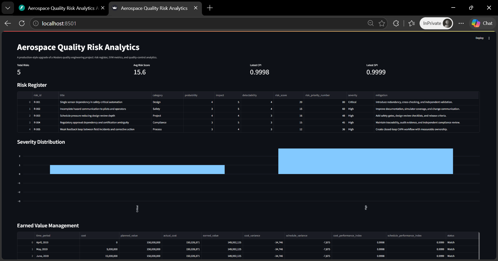
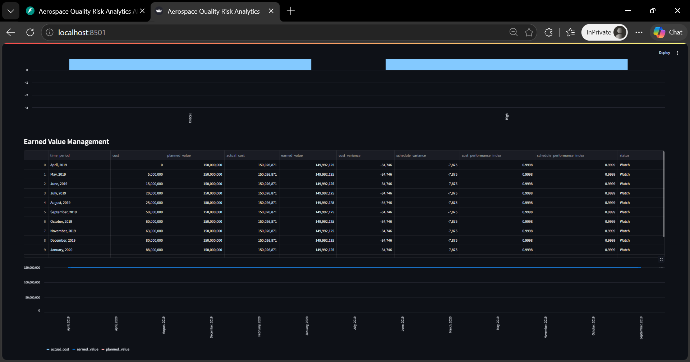
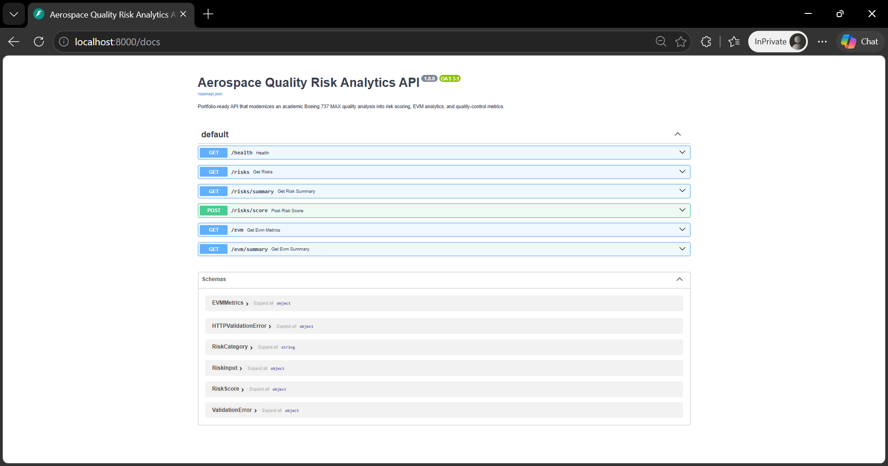
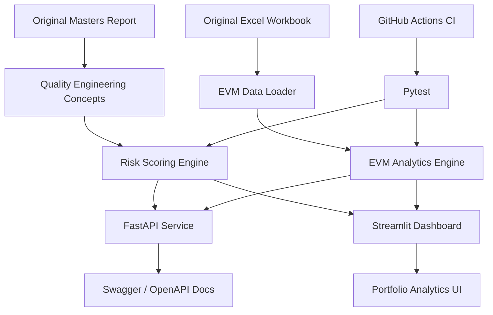

<div align="center">

# ✈️ Aerospace Quality Risk Analytics

### Portfolio-ready aerospace quality engineering platform for risk scoring, EVM analytics, and executive project-control visibility.

<p>
  
  
  
</p>

<p>
  
  
  
</p>

<p>
  <a href="#-overview">Overview</a> •
  <a href="#-features">Features</a> •
  <a href="#-screenshots">Screenshots</a> •
  <a href="#-architecture">Architecture</a> •
  <a href="#-quick-start">Quick Start</a> •
  <a href="#-api-reference">API</a> •
  <a href="#-troubleshooting">Troubleshooting</a>
</p>

</div>

---

## 📌 Overview

**Aerospace Quality Risk Analytics** is a production-style modernization of a Masters-level Quality Systems Engineering project focused on the Boeing 737 MAX case study. The original academic intent is preserved through the report and workbook, while the repository now adds a real Python analytics layer, FastAPI endpoints, a Streamlit dashboard, Docker support, CI/CD, and automated tests.

The project turns static quality-management concepts into a measurable engineering artifact: **risk scoring**, **FMEA-style Risk Priority Numbers**, **earned value management**, **quality-control recommendations**, and **executive dashboarding**.

---

## ✨ Features

<table>
<tr>
<td width="33%" valign="top">

### 🧮 Risk Analytics

- Aerospace risk register
- Probability-impact scoring
- Risk Priority Number calculation
- Severity classification
- Category/severity filters
- Probability-impact heatmap

</td>
<td width="33%" valign="top">

### 📊 EVM Analytics

- Excel workbook ingestion
- Planned Value / Actual Cost / Earned Value
- CPI and SPI calculation
- Cost and schedule variance
- Project-health snapshot
- Trend visualization

</td>
<td width="33%" valign="top">

### 🚀 Engineering

- FastAPI backend
- Streamlit dashboard
- Pydantic validation
- Pytest test suite
- Docker support
- GitHub Actions CI

</td>
</tr>
</table>

---

## 🧱 Tech Stack

<div align="center">

<table>
<tr>
<td align="center" width="25%">
<br/>
<b>Python</b><br/>
Core Logic
</td>

<td align="center" width="25%">
<br/>
<b>FastAPI</b><br/>
Backend API
</td>

<td align="center" width="25%">
<br/>
<b>Streamlit</b><br/>
Dashboard
</td>

<td align="center" width="25%">
<br/>
<b>Pandas</b><br/>
Data Processing
</td>
</tr>

<tr>
<td align="center">
<br/>
<b>Pydantic</b><br/>
Schemas
</td>

<td align="center">
<br/>
<b>Pytest</b><br/>
Testing
</td>

<td align="center">
<br/>
<b>GitHub Actions</b><br/>
CI/CD
</td>

<td align="center">
<br/>
<b>Docker</b><br/>
Containerization
</td>
</tr>
</table>

</div>

---

## 📸 Screenshots

### Dashboard Overview

<p align="center">
  
</p>

### EVM Performance Analysis

<p align="center">
  
</p>

### API Documentation

<p align="center">
  
</p>

---

## 🏗️ Architecture

<div align="center">



</div>

### 🔄 End-to-End Workflow

```text
Original Academic Report and Workbook
        ↓
Extract Quality, Risk, and EVM Concepts
        ↓
Convert Static Tables into Python Data Models
        ↓
Risk Engine Calculates Probability × Impact and RPN
        ↓
EVM Engine Calculates CV, SV, CPI, and SPI
        ↓
FastAPI Exposes Analytics Endpoints
        ↓
Streamlit Dashboard Visualizes Risk and Project Health
        ↓
Pytest and GitHub Actions Validate Core Logic
```

### System Flow

| Step |                               What Happens                                        |
|------|-----------------------------------------------------------------------------------|
|  1   | Original report and Excel workbook are preserved under project documentation/data |
|  2   | Risk records are converted into structured Python objects                         |
|  3   | Risk engine calculates score, RPN, and severity                                   |
|  4   | EVM engine loads workbook data and calculates schedule/cost indicators            |
|  5   | FastAPI exposes JSON endpoints for analytics consumers                            |
|  6   | Streamlit presents dashboard tabs, filters, heatmaps, and recommendations         |

---

<details>
<summary><strong>📁 Folder Structure</strong></summary>

```text
aerospace-quality-risk-analytics/
├── app/
│   ├── main.py                  # FastAPI app and routes
│   ├── schemas.py               # Pydantic request/response models
│   ├── risk_engine.py           # Risk scoring and summaries
│   ├── evm_engine.py            # EVM workbook analytics
│   └── quality_metrics.py       # Quality metric helpers
├── dashboard/
│   └── streamlit_app.py         # Streamlit analytics dashboard
├── data/
│   ├── raw/evm_data.xlsx        # Original workbook data
│   └── processed/.gitkeep
├── docs/
│   ├── original_project_report.pdf
│   ├── architecture.md
│   └── screenshots/
├── scripts/
│   └── export_processed_data.py
├── tests/
│   ├── test_risk_engine.py
│   └── test_evm_engine.py
├── .github/workflows/ci.yml
├── Dockerfile
├── requirements.txt
├── pyproject.toml
├── LICENSE
└── README.md
```

</details>

---

## ⚡ Quick Start

### Prerequisites

| Requirement |       Version      |
|-------------|--------------------|
| Python      | 3.11+              |
| pip         | Latest recommended |
| Docker      | Optional           |
| Git         | Any recent version |

### Create Environment

```bash
python -m venv .venv
source .venv/bin/activate      # macOS/Linux
# .venv\Scripts\activate       # Windows PowerShell
pip install -r requirements.txt
```

### Run FastAPI

```bash
uvicorn app.main:app --reload
```

Open:

```text
http://localhost:8000/docs
```

### Run Streamlit Dashboard

Run this command from the project root:

```bash
streamlit run dashboard/streamlit_app.py
```

Open:

```text
http://localhost:8501
```

### Run Tests

```bash
pytest -q
```

### Run Ruff

```bash
ruff check .
ruff check . --fix
```

### Run with Docker

```bash
docker build -t aerospace-quality-risk-analytics .
docker run -p 8000:8000 aerospace-quality-risk-analytics
```

---

## 🔌 API Reference

### Health Check

```bash
curl http://localhost:8000/health
```

### Get Risk Register

```bash
curl http://localhost:8000/risks
```

### Get Risk Summary

```bash
curl http://localhost:8000/risks/summary
```

### Score a Custom Risk

```bash
curl -X POST http://localhost:8000/risks/score \
  -H "Content-Type: application/json" \
  -d '{
    "risk_id": "R-900",
    "title": "Sensor redundancy gap",
    "category": "Design",
    "probability": 4,
    "impact": 5,
    "detectability": 3,
    "mitigation": "Add independent validation and redundancy checks."
  }'
```

### Get EVM Metrics

```bash
curl http://localhost:8000/evm
```

### Get EVM Summary

```bash
curl http://localhost:8000/evm/summary
```

---

## 🧪 What This Project Demonstrates

|       Skill Area       |                     Demonstrated Through                         |
|------------------------|------------------------------------------------------------------|
| Backend Engineering    | FastAPI routes, Pydantic schemas, clean Python modules           |
| Data Analytics         | Pandas workbook ingestion, EVM metrics, aggregation logic        |
| Quality Engineering    | Risk register, RPN, mitigation tracking, quality-control actions |
| Dashboarding           | Streamlit tabs, filters, KPIs, heatmap, trend charts             |
| Testing                | Pytest coverage for risk and EVM calculations                    |
| DevOps                 | Dockerfile, GitHub Actions, Ruff linting                         |
| Portfolio Storytelling | Academic project modernized into an engineering product          |

---

## 🧰 Troubleshooting

<details>
<summary><strong>ModuleNotFoundError: No module named 'app' when running Streamlit</strong></summary>

Run Streamlit from the repository root:

```bash
streamlit run dashboard/streamlit_app.py
```

The dashboard also inserts the project root into `sys.path`, so this error should be resolved in the current version.

</details>

<details>
<summary><strong>Ruff reports import sorting or Optional type errors</strong></summary>

Run:

```bash
ruff check . --fix
```

The project uses modern Python 3.11 union syntax such as:

```python
str | None
```

</details>

<details>
<summary><strong>FastAPI server appears stuck after startup</strong></summary>

That is expected. The API is running and waiting for requests.

Open:

```text
http://localhost:8000/docs
```

Stop it with:

```text
Ctrl + C
```

</details>

<details>
<summary><strong>Streamlit opens but charts look different from README screenshots</strong></summary>

The README screenshots are demo captures. The dashboard can change slightly based on Streamlit version, browser size, and theme.

</details>

---

## 🗺️ Roadmap

| Priority |                       Improvement                           |
|----------|-------------------------------------------------------------|
|   High   | Add uploaded workbook support from the dashboard            |
|   High   | Add SQLite/PostgreSQL persistence for custom risk registers |
|  Medium  | Add downloadable PDF/HTML risk reports                      |
|  Medium  | Add Plotly-based interactive heatmaps and drilldowns        |
|  Medium  | Add authentication for saved project workspaces             |
|   Low    | Add Kubernetes manifests                                    |
|   Low    | Add cloud deployment templates                              |
|   Low    | Add Grafana/Prometheus observability example                |

---

## 📄 License

This project is licensed under the [MIT License](LICENSE).

---

## 🎓 Academic Foundation

This project originates from research and analysis conducted during the **Master of Engineering (Quality Systems Engineering)** program at **Concordia University**.

The original work investigated the organizational, engineering, quality assurance, and risk management factors that contributed to the Boeing 737 MAX program challenges. The study applied industry-standard quality engineering methodologies including risk management, Earned Value Management (EVM), quality control planning, root-cause analysis, stakeholder management, and process improvement techniques.

This repository modernizes that academic research into a **portfolio-grade Python analytics platform** featuring automated risk scoring, EVM performance analysis, quality-control metrics, interactive dashboards, REST APIs, testing, CI/CD, and containerization while preserving the original quality engineering objectives and analytical framework.

---

## ⚠️ Disclaimer

This project is intended strictly for educational, portfolio, and quality-engineering demonstration purposes.

It does not represent official Boeing, FAA, NTSB, or aviation authority findings.
