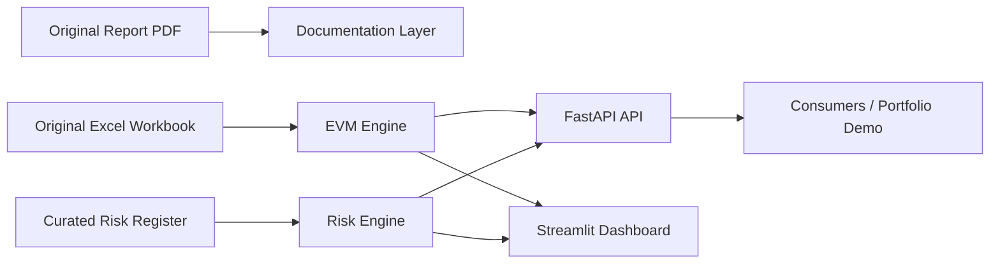

# Architecture

This repository preserves the original Masters project intent while adding a software engineering layer.

## Goal

Transform a static Boeing 737 MAX quality-control case study into a reusable analytics platform that demonstrates:

- risk scoring and prioritization
- Earned Value Management analytics
- quality-control metric calculations
- API design
- dashboarding
- automated testing
- Dockerized deployment readiness

## Components

## Data Flow

1. The original workbook is stored under `data/raw/evm_data.xlsx`.
2. `app/evm_engine.py` loads PV, AC, and EV values from the workbook.
3. EVM formulas generate CPI, SPI, cost variance, and schedule variance.
4. `app/risk_engine.py` converts qualitative risk concepts into scored risk records.
5. FastAPI exposes the analytics through REST endpoints.
6. Streamlit provides an interactive dashboard for visual review.
7. Pytest validates the calculation logic.

## Why This Fits a Software Engineering Portfolio

The original project is academic and quality-focused. The upgraded version demonstrates practical engineering by adding production-style packaging, typed Python modules, tests, CI, API contracts, Docker support, and dashboard delivery.
